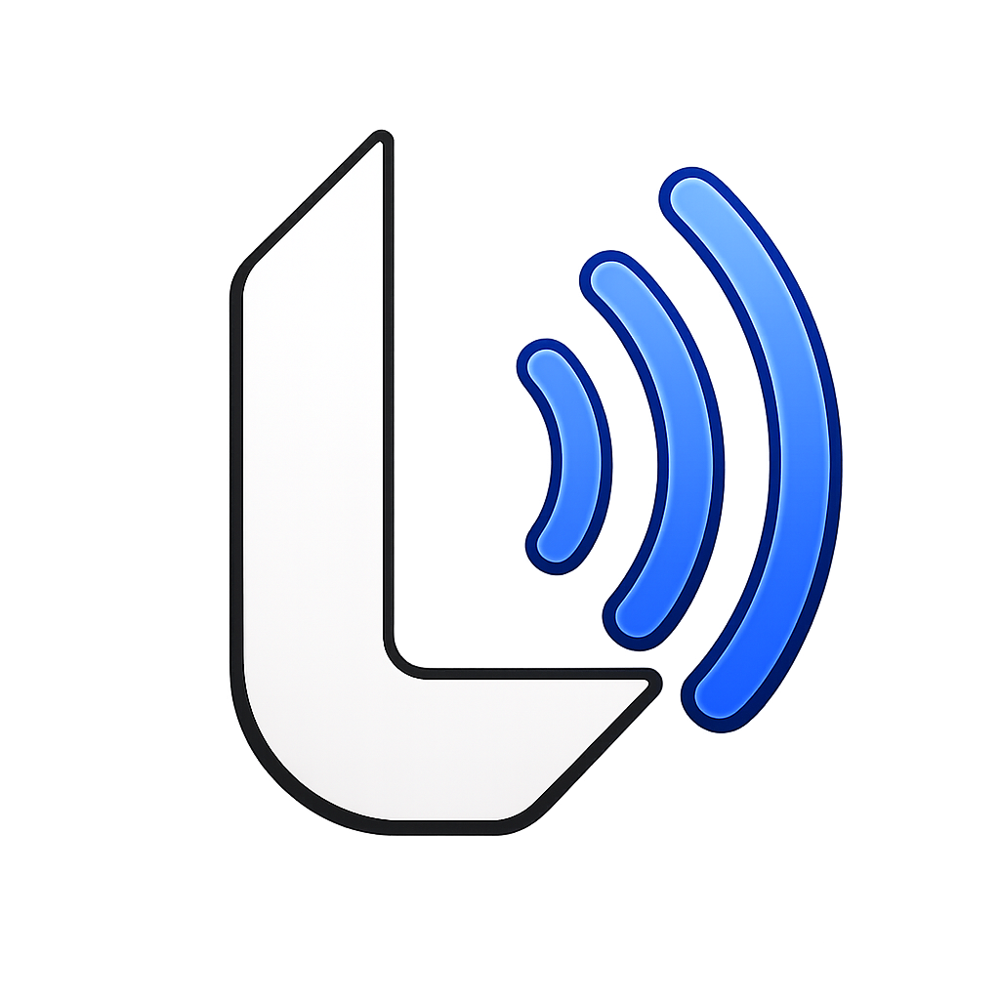

# LANCAST

**Broadcast on LAN. Encrypted. Instant. Traceless.**

---

### Zero Cloud · Zero Servers · Zero Accounts · Zero Traces

*Everything lives in RAM. When the app closes — it never happened.*

---

## What is LANCAST?

LANCAST is a **desktop application** for instant, end-to-end encrypted communication between devices on the same Wi-Fi network. There are no cloud servers, no third-party relays, no accounts to create, and no data written to disk. Every message, file, and session key lives exclusively in RAM and is permanently destroyed the moment the application closes.

Think of it as a **private broadcast frequency** — a temporary, encrypted channel that exists only as long as the devices broadcasting on it are present.

---

## Why LANCAST?

Every existing messaging tool stores something — in the cloud, on disk, in logs. LANCAST was built around a single principle: **the most secure data is data that never exists in the first place.**

Built for environments where privacy is not a feature but a requirement — boardrooms, research labs, secure offices, sensitive meetings, and anyone who believes what they say should stay exactly where they said it.

---

## Core Features

|  | Feature | Description |
|--|---------|-------------|
| 🔍 | **Auto-Discovery** | Finds LANCAST peers on the same Wi-Fi instantly via encrypted UDP multicast with magic-byte handshake |
| 🔐 | **End-to-End Encryption** | Every byte on the wire is AES-256-GCM encrypted with per-session ECDH Curve25519 keys |
| 💨 | **Zero Disk Storage** | Messages, keys, and sessions exist only in RAM — app close means total erasure |
| 🚫 | **Screenshot Protection** | OS-level DRM (`SetWindowDisplayAffinity` / `NSWindow sharingType`) blocks all capture tools |
| 👥 | **Groups** | Create public or private groups with real-time invite and join flows |
| 📁 | **File Transfer** | Send any file type up to 100MB in chunked, encrypted streams |
| 📡 | **Broadcast Mode** | Announce your presence on the network — you control when you're visible |
| 🔔 | **Real-time Notifications** | Live invite notifications with one-tap accept/reject |
| 🕶️ | **Dark-First UI** | Minimal, full-screen dark interface — no clutter, no distractions |

---

## Security Architecture

LANCAST is built with a layered security model where every primitive serves a specific, non-redundant purpose.

| Layer | Primitive | Purpose |
|-------|-----------|---------|
| **Discovery** | Encrypted UDP multicast + magic bytes | Peer visibility limited to LANCAST apps only |
| **Key Exchange** | ECDH Curve25519 | Perfect forward secrecy — each session gets a unique shared secret |
| **Encryption** | AES-256-GCM | Authenticated encryption of all payloads |
| **Integrity** | HMAC-SHA512 | Message authentication and tamper detection |
| **Anti-Replay** | Sequence numbers | Prevents replaying captured encrypted packets |
| **Storage** | RAM only | Zero persistence — no files, no logs, no traces |
| **Capture** | OS-level DRM | Screenshot and screen-recording blocked at the window level |

**What an attacker sees on the wire:** Encrypted random bytes. No usernames. No room names. No content. The Wi-Fi administrator is blind. A network packet capture yields nothing actionable.

---

## Tech Stack

| Layer | Technology |
|-------|-----------|
| **Frontend** | React 18 + JSX + Tailwind CSS |
| **Backend** | Rust + Tauri 2.0 |
| **Build** | Vite 5 + GitHub Actions |
| **Output** | `.msi` (Windows) · `.dmg` (macOS) · `.AppImage` (Linux) |
| **Binary Size** | ~4–8 MB |
| **RAM Usage** | ~15–30 MB |

---

## How It Works

### 1. Peer Discovery

When LANCAST launches, it broadcasts an encrypted UDP multicast packet to the LAN segment containing a LANCAST-specific magic byte sequence. Only other LANCAST instances respond. Non-LANCAST devices on the same network remain entirely unaware of the broadcast.

### 2. Session Establishment

Once two peers discover each other, they perform an ECDH Curve25519 key exchange. Each session derives a unique shared secret — even if a prior session's traffic was captured, it cannot be used to decrypt a new session.

### 3. Encrypted Messaging

All payloads are encrypted with AES-256-GCM and authenticated with HMAC-SHA512 before transmission. Sequence numbers prevent replay attacks. Messages travel peer-to-peer — there is no intermediary.

### 4. RAM-Only Lifecycle

No message, key, or session state is ever written to disk. Zustand (frontend) and in-memory Rust structures (backend) hold all state. When the application process terminates, the OS reclaims the memory and the data is gone permanently.

---

## Screenshot Protection

When a user is inside any Chat, Group, or Peers view, the application window is marked as protected at the OS level:

- **Windows:** `SetWindowDisplayAffinity(HWND, WDA_EXCLUDEFROMCAPTURE)` — the window renders as black in any capture tool
- **macOS:** `NSWindow.sharingType = .none` — the window is excluded from all capture APIs
- **Linux:** Best-effort via compositor hints (Wayland/X11 support varies by compositor)

When a screenshot attempt is detected, a system-level alert is sent into the active chat or group as a danger notification including the name of the user who attempted the capture.

---

## Broadcast Mode

By default, a user is not visible to peers. Clicking **Broadcast** in the sidebar announces the user's presence on the network. The indicator dot transitions from red (inactive) to green (broadcasting) only after the first encrypted peer acknowledgment is received — not on click, but on actual network confirmation.

---

## Group System

**Public Groups** are visible in the Peers page and joinable by any active peer. **Private Groups** are completely invisible to non-members — they do not appear in any list and their name is never transmitted unless an explicit invite is issued.

Invites carry the group name, the inviting peer's name, and a real-time member count that updates live. Accepting an invite adds the user to the group and posts a system message visible to all current members. Declining silently invalidates the invite notification.

---

## File Transfer

Files of any extension — archives, documents, video, executables, anything — can be sent up to 100 MB per transfer, with a maximum of 4 files per send. Files are split into encrypted chunks, streamed over the peer TCP connection, and reassembled on the receiving end. No file is written to disk until the receiver explicitly clicks the download button.

---

## Roadmap

- [ ] Ephemeral voice channels (LAN-only WebRTC, no STUN/TURN)
- [ ] Disappearing message timers
- [ ] Multi-hop mesh routing for large networks
- [ ] CLI companion tool for headless servers
- [ ] Plugin API for custom message renderers

---

## Contributing

Contributions are welcome. Please open an issue before submitting a pull request so the approach can be discussed. All contributions must maintain the zero-disk, zero-cloud, zero-account philosophy of the project.

---

## License

Licensed under the [Apache License 2.0](LICENSE).

---

---

*Crafted with intent by*

**Sambhav Dwivedi**

---

Built with ♥ using Rust, React, and Tauri · Made in India 🇮🇳

